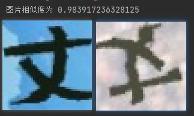

之前没有训练的时候开启这个

`mymox = Siamese()  # 重新训练`

之前训练过就可以再次训练 可以继承上次的模型进行优化

`mymox = torch.load('./bj.pth') # 迁移学习`

epoch = 10 # 训练多少epoch

把训练的图片保存在train文件夹下面
```
train
   丁
     丁_672.png
     丁_673.png
     .....
   七
     七_7408.png
     七_7409.png
     .....
```


把测试的图片保存在val文件夹下面
```
val
   丁
     丁_672.png
     丁_673.png
     .....
   七
     七_7408.png
     七_7409.png
     .....
```

### 启动训练
    运行 train.py 文件

### 测试模型
    运行 text.py 文件

 
